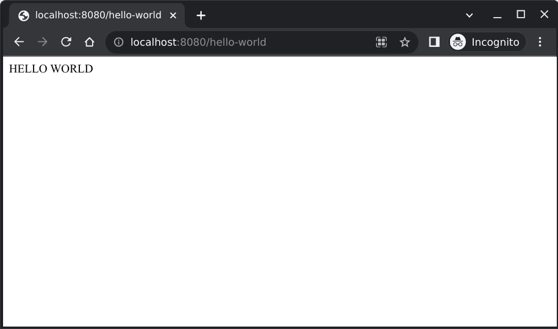

# htss - Hunchentoot Simple Server

Starting a process that runs a server should be as simple as running an executable, shouldn't it?

1. Download the binary from the [Releases](https://github.com/digikar99/hunchentoot-simple-server/releases).

```sh
export RELEASE_VERSION=v0.1.0
export RELEASE_NAME=htss-ubuntu-20.04-$RELEASE_VERSION
wget https://github.com/digikar99/hunchentoot-simple-server/releases/download/$RELEASE_VERSION/$RELEASE_NAME.gz
gzip -d $RELEASE_NAME.gz
ln -s $RELEASE_NAME htss # make it easier to type
```

2. Run it!

```sh
$ ./htss 
Usage: htss [options] additional-server-files
Available options:
  -h, --help               Show this help text
  -n, --no-ssl             Start the server without SSL
  -s, --server-address ARG <address>:<port> on which to run the server [default: localhost:8000]
  -p, --swank-port ARG     Port number at which to start swank
  -d, --server-root ARG    The root directory from which to serve files (default: current-directory)

additional-server-files: additional lisp files to load
```

3. Create additional lisp files, for example an index.lisp in the same directory as htss:

```lisp
;; Contents of file index.lisp
(in-package :hunchentoot-simple-server)
(use-package :alexandria)

(setq hunchentoot:*dispatch-table*
      (list (create-prefix-dispatcher "/hello-world" 'hello-world)
            'dispatch-easy-handlers))

(defun hello-world ()
  "HELLO WORLD")
```

4. Run the server:

```sh
$ htss --no-ssl -s localhost:8080 index.lisp
Will run the server on localhost:8080
Skipping swank as the port was not supplied
Loading index.lisp... Done.
127.0.0.1 - [2023-01-03 11:35:56] "GET / HTTP/1.1" 404 290 "-" "Mozilla/5.0 (X11; Linux x86_64) AppleWebKit/537.36 (KHTML, like Gecko) Chrome/108.0.0.0 Safari/537.36"
127.0.0.1 - [2023-01-03 11:35:57] "GET /favicon.ico HTTP/1.1" 404 301 "http://localhost:8080/" "Mozilla/5.0 (X11; Linux x86_64) AppleWebKit/537.36 (KHTML, like Gecko) Chrome/108.0.0.0 Safari/537.36"
127.0.0.1 - [2023-01-03 11:36:04] "GET /hello-world HTTP/1.1" 200 11 "-" "Mozilla/5.0 (X11; Linux x86_64) AppleWebKit/537.36 (KHTML, like Gecko) Chrome/108.0.0.0 Safari/537.36"
127.0.0.1 - [2023-01-03 11:36:34] "GET /hello-world HTTP/1.1" 200 11 "-" "Mozilla/5.0 (X11; Linux x86_64) AppleWebKit/537.36 (KHTML, like Gecko) Chrome/108.0.0.0 Safari/537.36"

...
```



# Included packages

- [alexandria](https://common-lisp-libraries.readthedocs.io/alexandria/)
- [shasht](https://github.com/yitzchak/shasht) package renamed to `json`.

# Contributing

- Test and easen setting up SSL and HTTPS
- Extend to more OS
