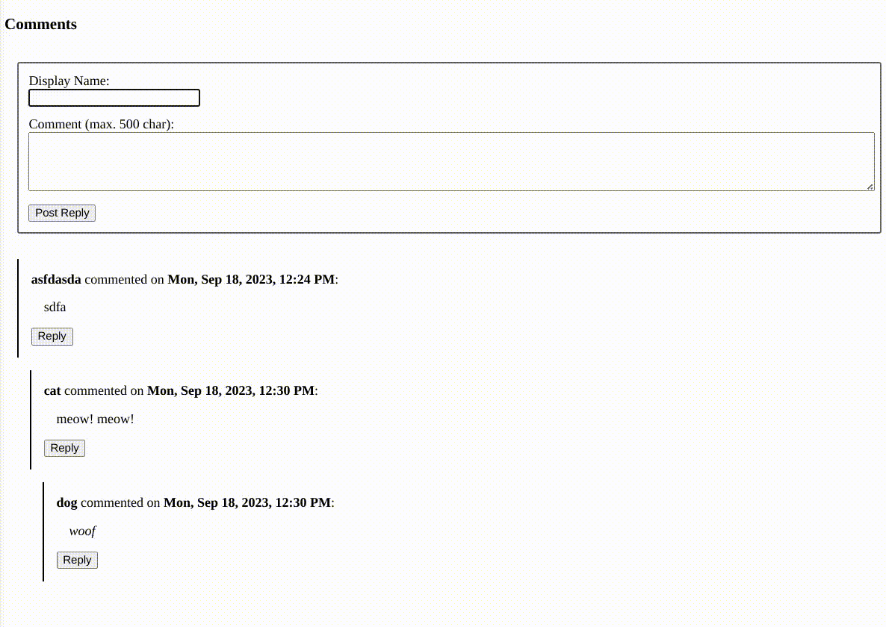

Simple Comments
---

File: simple-comments.lisp

This plugin provides the ability for readers to comment on your webpage.

This does not rely on any third party services, and no registration is involved. It is expected that display names of the comments will allow for identification between different individuals. This also allows individuals to interact without revealing any other identifying information about themselves.

The independent nature of the plugin also means that you should be able to use it decades into the future - or at least so long as basic HTML/JS/CSS/Common-Lisp allows them without relying very much on third party libraries.



## Steps to add it to your htss powered webpage

Add the following html to your head:

```html
<link rel="stylesheet" href="path/to/simple-comments/simple-comments.css">
<script src="path/to/simple-comments/simple-comments.js"></script>
```

Optionally, create a `div` with `id="simple-comments"` in your html page. By default, this div would be created as the last element of the `body` tag. 

```html
<div id="simple-comments"></div>
```

## API

Provides the following APIs:

- add-comment
- view-comment

Lisp configuration variables:

- +comment-api-root+
- +comment-storage-root+
- +comment-char-limit+
- +disable-captcha+

JS configuration variables:

- COMMENT_API_ROOT
- COMMENT_CHAR_LIMIT

CSS configuration: see simple-comments.css in the current directory.

No delete-comment API is provided. Such an option does not make sense in the absence of user authentication.
